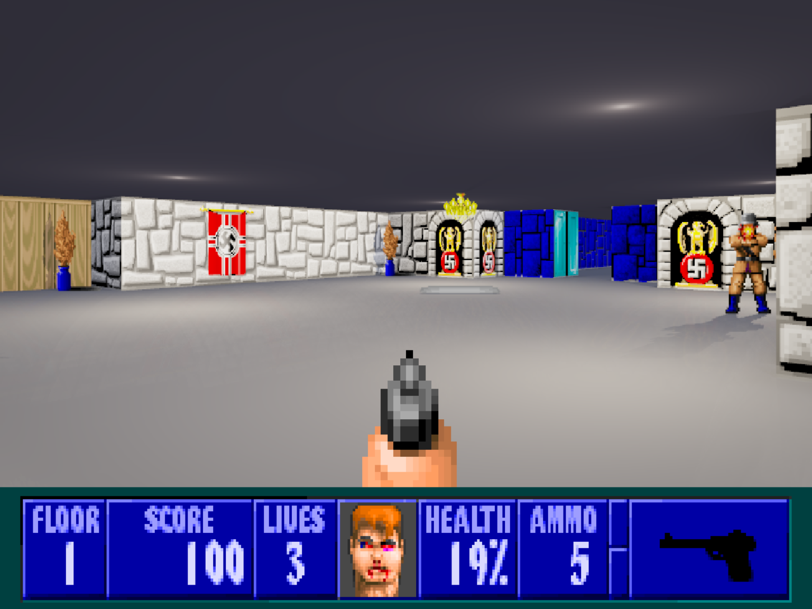
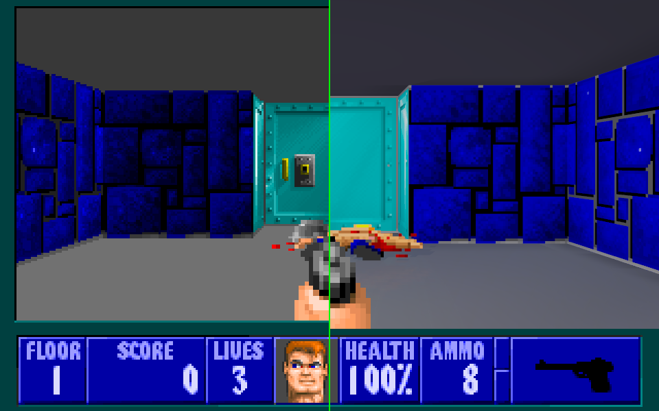
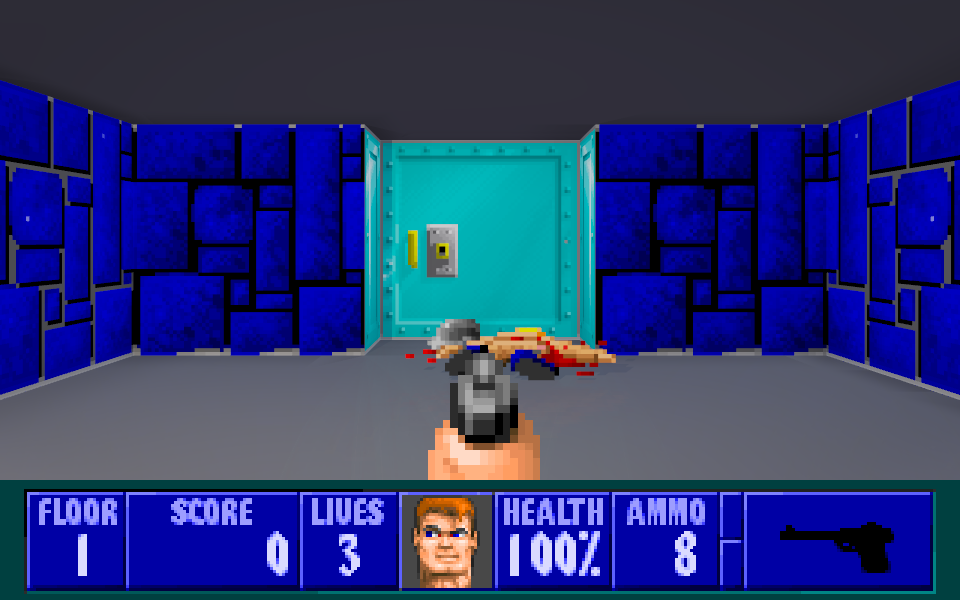

# Wolfenstein 3D: Path Traced

**Wolfenstein 3D was a raycaster. So we gave it real rays.**



*A grand hall, path traced in real time on the GPU. The polished floor and
ceiling catch the overhead lights, stone, brick, wood and hanging banners read as
distinct materials, and every prop and guard grounds itself with a real shadow —
all from the exact same 1992 map geometry the original raycaster drew flat.*

## Credits, and a small confession

Standing on the shoulders of giants, then handing them a GPU they never asked for:

- **id Software** — John Carmack, John Romero, Tom Hall, Adrian Carmack and
  Robert Prince — for the original *Wolfenstein 3D* (1992): the engine, the maps,
  the guards, the entire reason any of this is fun. Their simulation is still the
  authority here; we didn't touch a line of it.
- **Fabien Sanglard** — for [*Chocolate Wolfenstein 3D*](https://github.com/fabiensanglard/Chocolate-Wolfenstein-3D),
  the clean, readable C++ modernization we forked as our base. Grafting a path
  tracer on took a weekend instead of a decade purely because this was the perfect starting point.

Now, the confession: **nobody needed this.** In 1992, **id Software** shipped
a game that faked 3D with a raycaster clever enough to run on a 386, and it was
*perfect*. The 386 is at peace. The raycaster owes us nothing. This bolts a
per‑frame hardware BVH and a `VK_KHR_ray_query` path tracer onto it anyway.

Is path tracing a 34‑year‑old raycaster *useful*? No. Is it a little bit magic (and funny AF) to
watch a flat 1992 sprite cast a genuine shadow across a floor that's busy
reflecting the room back at it?... Yeah. That's the whole project. Enjoy.

This is a *source modification* of Wolfenstein 3D. The original game
code — movement, collision, enemies, AI, doors, pushwalls, pickups, secrets,
level flow, scoring, menus, save/load — remains the authoritative simulation. A
modern SDL2 platform layer replaces the DOS/VGA shell, and a **Vulkan hardware
ray‑traced renderer** is grafted alongside the classic raycaster, visualising the
exact same live game state as real 3D geometry with real light.

There is only ever **one simulation**. The path tracer just draws what the
original code is already doing — but with real shadows, reflective floors,
alpha‑tested sprite shadows, emissive doors and dynamic muzzle flashes.



*Left: the original raycaster. Right: the same frame, path traced — glowing
elevator door, a polished floor reflecting the walls and the fallen guard, soft
ambient occlusion, warm volumetric‑feeling light. Instantly Wolfenstein,
instantly impossible for 1992.*



---

## What it is

* A fork of the original Wolfenstein 3D source (via the clean
  *Chocolate‑Wolfenstein‑3D* C++ modernization). Original files (`wl_*.cpp`,
  `id_*.cpp`) stay recognizable and authoritative.
* A modern platform layer (SDL2 + Vulkan) replacing the DOS video / input /
  timing / audio.
* A **`VK_KHR_ray_query` compute path tracer** running on real hardware
  acceleration structures — genuine ray tracing, not a fake.
* Instant, in‑engine **comparison modes**: classic, path traced, split, moving
  wipe, freeze.

## Features

**Renderer**
- Hardware ray tracing (ray‑query compute) against a per‑frame TLAS built from
  the live game state.
- Walls / doors / pushwalls as boxes, floor & ceiling as planes, enemies &
  pickups as camera‑facing **alpha‑tested billboards**.
- **Sprite shadows** — a flat 1992 sprite casts a real shadow via alpha‑tested
  shadow rays.
- **Reflective floors** with Fresnel — walls, doors and sprites mirror in the
  polished floor.
- Ray‑traced shadows, ambient occlusion, deterministic 4× anti‑aliasing (no
  temporal shimmer — a static scene renders byte‑identical frames), ACES filmic
  tone mapping, bloom and a subtle vignette.
- A lighting layer (ceiling lamps, muzzle flashes) that keeps the whole campaign
  readable — not a horror‑darkness pass.

**Game (preserved from the original)**
- Full shareware campaign playable: movement, collision, enemies, AI, doors,
  pushwalls, pickups, secrets, keys, scoring, lives, menus, intermissions,
  save/load, difficulty.
- Original VSWAP textures and sprites, original palette, original AdLib/OPL
  music and digitized sound (through a custom SDL2 audio bridge).

## Building (Linux)

Dependencies: a C++17 compiler, CMake ≥ 3.16, SDL2, the Vulkan loader + headers,
and `glslc` (shaderc).

On **Fedora**:

```sh
sudo dnf install cmake ninja-build gcc-c++ SDL2-devel vulkan-loader-devel \
                 vulkan-headers glslc
```

On **Ubuntu / Debian**:

```sh
sudo apt install build-essential cmake ninja-build libsdl2-dev libvulkan-dev glslc
```

> `glslc` lives in Ubuntu's `universe` component; if `apt` can't find it, enable
> universe (`sudo add-apt-repository universe`) or install the LunarG Vulkan SDK,
> which bundles it.

Then:

```sh
cmake -G Ninja -B build -DCMAKE_BUILD_TYPE=Release
cmake --build build
```

The path tracer needs a GPU with `VK_KHR_ray_query` + `VK_KHR_acceleration_structure`
(any recent AMD RDNA2+, NVIDIA RTX, or Intel Arc). Without it the game still runs
in classic mode.

## Running

The freely‑distributable Wolfenstein 3D v1.4 **shareware** (Episode 1) data is
bundled in `assets/data/`, so it works out of the box — nothing else to download.
To play the full game or Spear of Destiny instead, point the engine at your own
legally‑obtained data:

```sh
./build/wolf3d-pt --data /path/to/wolf3d/data
WOLF3D_DATA=/path/to/wolf3d/data ./build/wolf3d-pt
```

The engine auto‑detects shareware (`*.wl1`), full Wolf3D (`*.wl6`), or Spear of
Destiny (`*.sod`) data by the `vswap.*` file present.

## Controls

The **path tracer runs by default**; the classic raycaster is one keypress away.
Standard Wolfenstein 3D controls apply (arrows / WASD to move, Ctrl to fire,
Space to open doors, `1`‑`4` weapons, Esc for the menu), plus renderer hotkeys:

| Key | Action |
|-----|--------|
| `F8` | Toggle classic raycaster ⇄ path tracer |
| `F7` / `F9` | Toggle the side‑by‑side split comparison |
| `F5` | Screenshot (classic + path‑traced + split, exported as BMP) |
| `[` / `]` | Fewer / more reflection bounces |

Cheats are available as launch flags: `--god` (invulnerability), `--guns`
(all weapons and full ammo at the start of every level), `--items` (weapons,
ammo, all keys and full health every level), `--ammo` (infinite ammo),
`--noclip` (walk through walls), and `--tedlevel <n>` (jump straight to a
level; combine with a difficulty flag like `--normal`).

`--dark` turns off every path-tracer world light (ambient fill and all lamp /
ceiling lights): levels are pitch black, and only your muzzle flash and enemy
projectiles light the world. Only affects the path-traced renderer — the
classic renderer (`F8`) is unlit and stays fullbright.

Only the live 3D view is path traced; menus and intermissions always use the
classic frame.

## Headless / scripted testing

The engine ships with a small **autopilot** for automated, display‑free testing
and demo capture, driven by environment variables:

```sh
WOLFPT_MODE=pt WOLFPT_SCRIPT="1000 key enter; 6000 mode split; 7000 shot; 8000 quit" \
  ./build/wolf3d-pt
```

Timestamps are milliseconds from launch; verbs are `key`/`hold`/`release`,
`mode` (`classic`/`pt`/`split`/`wipe`/`freeze`), `shot`, `quit`. See
`src/platform/autopilot.h`.

Environment variables:

| Variable | Effect |
|----------|--------|
| `WOLFPT_MODE` | Initial renderer mode (`classic`/`pt`/`split`/`wipe`/`freeze`) |
| `WOLFPT_SCRIPT` | Scripted input/screenshot timeline (see above) |
| `WOLFPT_AUTOSHOT=<ms>` | Take a screenshot at `<ms>`, then quit shortly after |
| `WOLFPT_FPS=1` | Print per‑section path‑tracer timing (build / GPU / post) |
| `WOLF3D_DATA` | Path to the Wolf3D data directory |

## Architecture

See [docs/ARCHITECTURE.md](docs/ARCHITECTURE.md). In brief:

```
Game simulation (original wl_*.cpp / id_*.cpp)
        │  (unchanged; still draws the classic frame into an 8-bit buffer)
        ▼
Scene extraction (src/rt/rt_scene_extract.cpp)
        │  reads live globals -> a renderer-friendly rt::Scene
        ▼
Renderer backend
    ├─ Classic: the 8-bit software frame, blitted through Vulkan
    └─ Path traced: rt_pathtrace.cpp (ray-query compute) + rt_materials / rt_lights
        ▼
Compositor (src/compare) — classic | path traced (split / wipe / freeze) + HUD + weapon
        ▼
Vulkan present (src/rt/rt_vulkan.cpp) — one swapchain, 4:3 letterbox
```

## Licensing

Two separate licenses are in play:

- **Code** — the original Wolfenstein 3D source was released by id Software under
  the GNU GPL; this modification (and all the new renderer / platform code)
  inherits it.
- **Game data** — the bundled `assets/data/*.wl1` files are the **Wolfenstein 3D
  shareware** (Episode 1), © id Software. This is **not** GPL: it ships under
  id/Apogee's original shareware terms, which permit free, non‑commercial
  redistribution of the complete, unmodified shareware episode — the same
  freely‑distributable data other open‑source Wolf3D ports include.

The **registered** game (`*.wl6`) and **Spear of Destiny** (`*.sod`) are
commercial and are **not** included or redistributable; supply your own
legally‑obtained copies and the engine will auto‑detect them.
